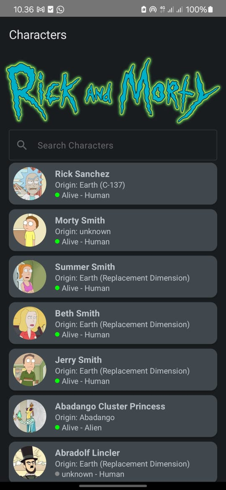
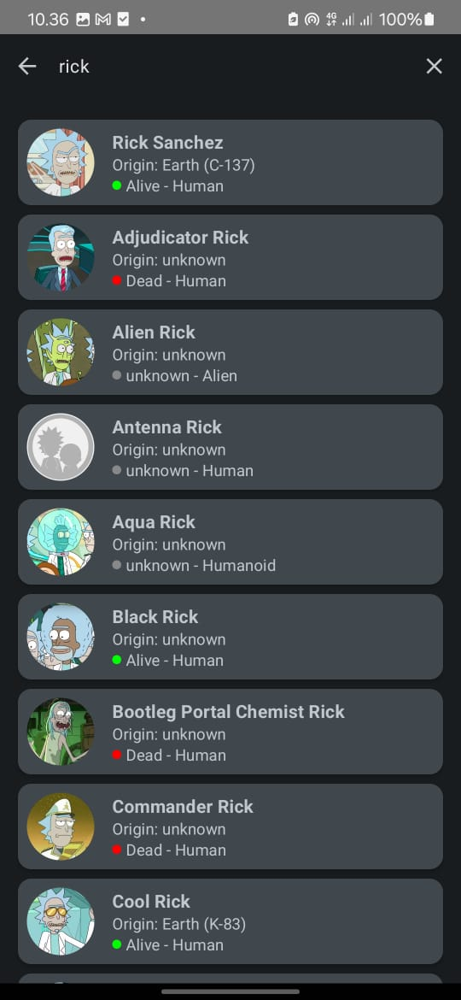
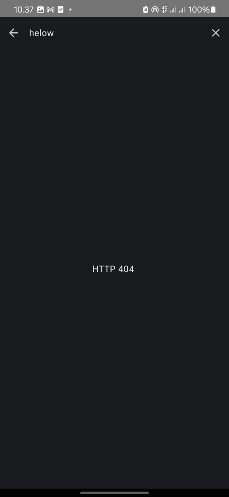

# RickAndMortyApp

RickAndMortyApp adalah aplikasi Android berbasis Kotlin yang menampilkan karakter dari serial Rick and Morty menggunakan API resmi [Rick and Morty API](https://rickandmortyapi.com/). Proyek ini dirancang menggunakan Jetpack Compose, clean architecture, serta dependency injection dengan Dagger Hilt.

## Fitur

- **Halaman Home:**
  - Menampilkan daftar karakter.
  - Search bar untuk mencari karakter.
  - Navigasi ke detail karakter.
- **Detail Karakter:**
  - Informasi lengkap tentang karakter (nama, status, spesies, asal, lokasi, dan gambar).
- **Search:**
  - Mencari karakter berdasarkan nama.

## Arsitektur

Aplikasi ini menggunakan **Clean Architecture** yang terdiri dari tiga lapisan utama:

1. **Domain Layer**
   - Berisi model domain dan use case.
2. **Data Layer**
   - Mengelola data dari sumber lokal (Room Database) dan remote (Retrofit).
   - Mengimplementasikan `Repository`.
3. **Presentation Layer**
   - Mengelola UI dengan Jetpack Compose dan state management.

## Teknologi yang Digunakan

- **Bahasa:** Kotlin
- **UI:** Jetpack Compose
- **Dependency Injection:** Dagger Hilt
- **Networking:** Retrofit + OkHttp
- **Database:** Room
- **Gambar:** Coil
- **Testing:** JUnit, Espresso

## Instalasi

1. Clone repository ini:
   ```bash
   git clone https://github.com/username/rickandmortyapp.git
   ```

2. Buka proyek dengan Android Studio.

3. Sinkronkan dependensi:
   ```bash
   ./gradlew build
   ```

4. Jalankan aplikasi di emulator atau perangkat fisik.

## Struktur Proyek

```plaintext
app/
├── data/
│   ├── local/                # Room database dan DAO
│   ├── remote/               # Retrofit API dan DTO
│   └── repository/           # Implementasi Repository
├── di/                       # Dependency Injection (Dagger Hilt)
├── domain/                   # Model dan Use Case
├── presentation/             # UI (Jetpack Compose)
├── utils/                    # Utility classes
└── MainActivity.kt           # Entry point aplikasi
```

## Screenshot
Berikut adalah beberapa tangkapan layar dari aplikasi:

 


##APK link:
https://drive.google.com/drive/folders/19106fbFzffWpsGv7aYSncv8Ll4M2FdOt?usp=sharing
